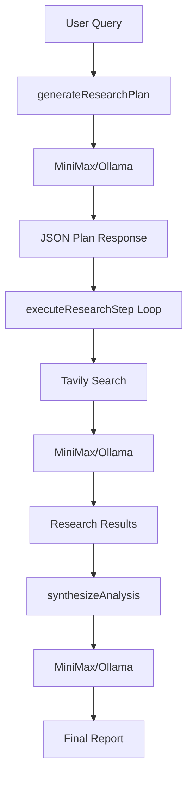

# Deep Researcher - LLM Provider Migration Plan

## Current Architecture
```
User Query → GeminiService → Google Search (grounding) → Research Results
```

## Proposed Architecture
```
User Query → AIService (abstract) → Search API (Tavily) → Research Results
                        ↓
              ┌─────────┴─────────┐
              ↓                   ↓
        MiniMax Service      Ollama Service
        (M2.5 Cloud)         (Llama 3.2 local)
```

## Key Changes

### 1. Abstract Service Layer
- Create `services/aiService.ts` - Abstract interface for LLM operations
- Define methods: `generateResearchPlan`, `executeResearchStep`, `synthesizeAnalysis`

### 2. MiniMax M2.5 Implementation
- **Model**: `MiniMax-M2.5` (or `abab6.5s-chat` for faster responses)
- **API Endpoint**: `https://api.minimax.chat/v1/text/chatcompletion_v2`
- **Environment Variables**:
  - `MINIMAX_API_KEY`
  - `MINIMAX_GROUP_ID`

### 3. Search Integration (Tavily)
- **API**: Tavily Search API (`https://api.tavily.com/search`)
- **Purpose**: Replace Google Search grounding
- **Environment Variables**: `TAVILY_API_KEY`

### 4. Ollama Implementation (Optional)
- **Endpoint**: `http://localhost:11434/api/generate`
- **Model**: `llama3.2`

## Implementation Files

| File | Purpose |
|------|---------|
| `services/aiService.ts` | Abstract interface |
| `services/minimaxService.ts` | MiniMax implementation |
| `services/ollamaService.ts` | Ollama implementation |
| `services/searchService.ts` | Tavily search integration |
| `services/factory.ts` | Service factory to create appropriate LLM |

## Configuration (.env.local)
```env
# LLM Provider (minimax | ollama)
LLM_PROVIDER=minimax

# MiniMax Config
MINIMAX_API_KEY=your_key_here
MINIMAX_GROUP_ID=your_group_id

# Ollama Config (if using ollama)
OLLAMA_BASE_URL=http://localhost:11434
OLLAMA_MODEL=llama3.2

# Search API
TAVILY_API_KEY=your_tavily_key
```

## Workflow Diagram



This plan replaces Gemini 3 Pro with MiniMax M2.5 (or Ollama Llama 3.2) while maintaining the same research workflow by integrating Tavily for search functionality.
